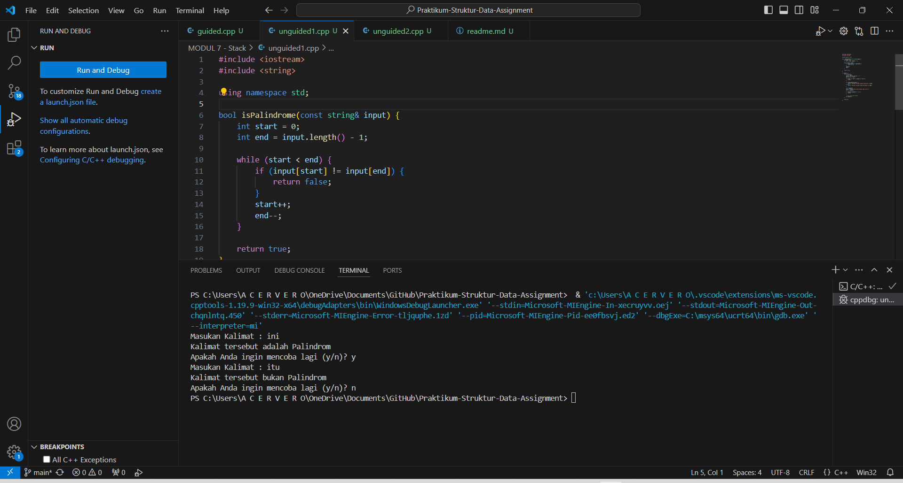
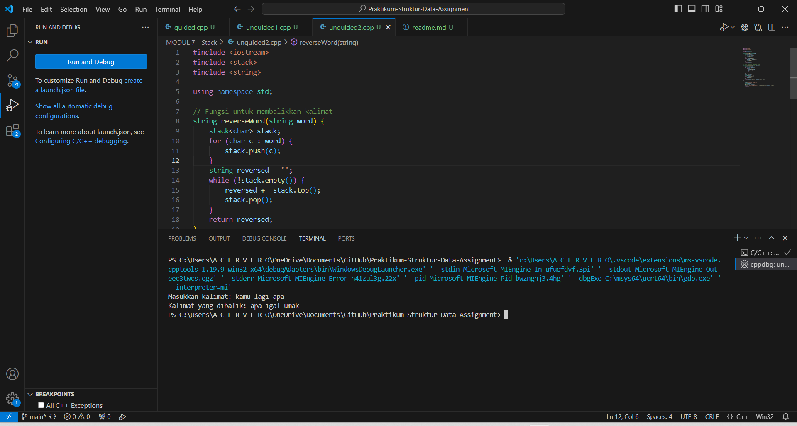

# <h1 align="center">Laporan Praktikum Modul Stack</h1>
<p align="center">Shafa Syahida</p>

## Dasar Teori

### Tipe Data
Tipe Data digunakan untuk mengklasifikasikan berbagai jenis data. Tipe data ini wajib ada agar kompiler dapat memahami bagaimana data harus diinterpretasikan. Berikut tipe data yang akan dipelajari:
1. Tipe data primitif
2. Tipe data abstrak
3. Tipe data koleksi

#### 1. Tipe Data Primitif
Tipe data primitif adalah tipe data dasar yang disediakan oleh banyak bahasa pemrograman. Karena dasar, tipe ini tidak diturunkan dari tipe data lain [1]. Contoh tipe data primitif, antara lain:
1. Int. Diambil dari kata integer, tipe data ini digunakan untuk menyimpan bilangan bulat, seperti 1, 2, 3 dan sebagainya.
2. Float. Tipe data ini digunakan untuk menyimpan bilangan pecahan atau desimal, seperti 1.1, 2.5 dan sebagainya.
3. Char. Diambil dari kata character, tipe data ini digunakan untuk menyimpan karakter tunggal yang didefinisikan dengan diawali dan diakhiri dengan tanda petik [2].  
4. Bool. Diambil dari kata Boolean, tipe data ini digunakan untuk menyimpan dua nilai saja, yaitu true dan false.

#### 2. Tipe Data Abstrak
ADT atau Abstract Data Type merupakan suatu tipe data buatan diri sendiri sesuai keinginan. ADT dapat diimplementasikan menggunakan struktur data (struct) sebagai alternatif implementasi [3]. Dalam C++, ADT dapat dibuat dalam sebuah class yang merupakan pengembangan dari struct [4]. Data dan fungsi yang dideklarasikan private tidak dapat diakses secara langsung oleh client (class), sementara data dan fungsi yang didekralasikan public dapat diakses oleh client secara langsung (struct) [4].

#### 3. Tipe Data Koleksi
Tipe data koleksi adalah struktur data yang digunakan untuk menyimpan dan mengelola kumpulan data sekaligus dalam satu variabel. Beberapa tipe data koleksi yang umum digunakan adalah array, vector, dan map. Array adalah struktur data statis yang menyimpan elemen dengan tipe data yang sama. Sementara itu, vector adalah struktur data dinamis yang bisa menyesuaikan ukurannya saat program berjalan. Dan yang terakhir, map mirip dengan array namun dengan indeks yang memungkinkan untuk berupa tipe data selain integer. Map mengaitkan kunci dengan nilai sebagai satu pasangan.

## Guided 

### 1. Tipe Data Primitif

```C++
#include <iostream>
using namespace std;
// Main program
main()
{
    char op;
    float num1, num2;
    // It allows user to enter operator i.e. +, -, *, /
    cin >> op;
    // It allow user to enter the operands
    cin >> num1 >> num2;
    // Switch statement begins
    
    switch(op)
    {
    // If user enter +
    case '+':
        cout << num1 + num2;
        break;
    // If user enter -
    case '-':
        cout << num1 - num2;
        break;
    // If user enter *
    case '*':
        cout << num1 * num2;
        break;
    // If user enter /
    case '/':
        cout << num1 / num2;
        break;
    // If the operator is other than +, -, * or /,
    // error message will display
    default:
        cout << "Error! operator is not correct";
    } // switch statement ends
    return 0;
}
```
Kode di atas mengimplementasikan operator aritmatika (+,-,*,/) pada dua angka float. Program ini menggunakan struktur kontrol 'switch' untuk mengevaluasi operator yang diberikan pengguna, kemudian menampilkan hasil operasi yang sesuai.

### 2. Tipe Data Abstrak

```C++
#include <stdio.h>

// Struct
struct Mahasiswa
{
    const char *name;
    const char *address;
    int age;
};

int main()
{

    // Menggunakan struct
    struct Mahasiswa mhs1, mhs2;
    // mengisi nilai ke struct
    mhs1.name = "Dian";
    mhs1.address = "Mataram";
    mhs1.age = 22;
    mhs2.name = "Bambang";
    mhs2.address = "Surabaya";
    mhs2.age = 23;

    // mencetak isi struct
    printf("## Mahasiswa 1 ##\n");
    printf("Nama: %s\n", mhs1.name);
    printf("Alamat: %s\n", mhs1.address);
    printf("Umur: %d\n", mhs1.age);
    printf("## Mahasiswa 2 ##\n");
    printf("Nama: %s\n", mhs2.name);
    printf("Alamat: %s\n", mhs2.address);
    printf("Umur: %d\n", mhs2.age);
    return 0;
    }
```
Kode di atas menggunakan struct yang digunakan untuk menyimpan beberapa variabel terkait dalam satu unit. Setelah dijalankan, program akan menampilkan informasi tentang dua mahasiswa, yang berisi nama, alamat, dan umur.

### 3. Tipe Data Koleksi

```C++
#include <iostream>
using namespace std;
int main()
{
    //deklarasi dan inisialisasi array
    int nilai[5];
    nilai[0] = 23;
    nilai[1] = 50;
    nilai[2] = 34;
    nilai[3] = 78;
    nilai[4] = 90;

    // mencetak array
    cout << "Isi array pertama :" << nilai[0] << endl;
    cout << "Isi array kedua :" << nilai[1] << endl;
    cout << "Isi array ketiga :" << nilai[2] << endl;
    cout << "Isi array keempat :" << nilai[3] << endl;
    cout << "Isi array kelima :" << nilai[4] << endl;
    return 0;
}
```
Kode di atas digunakan untuk mencetak isi array yang telah disisipkan. Pada program tersebut, ada sebuah array yang disisipkan dengan nilai 23, 50, 34, 78, dan 90. Setelah itu, menggunakan perintah cout, program akan menampilkan isi array yang telah disisipkan satu per satu.

## Unguided

### 1. Buatlah program untuk menentukan apakah kalimat tersebut yang diinputkan dalam program stack adalah palindrom/tidak. Palindrom kalimat yang dibaca dari depan dan belakang sama. Jelaskan bagaimana cara kerja programnya.

```C++
#include <iostream>
#include <string>

using namespace std;

bool isPalindrome(const string& input) {
    int start = 0;
    int end = input.length() - 1;

    while (start < end) {
        if (input[start] != input[end]) {
            return false;
        }
        start++;
        end--;
    }

    return true;
}

int main() {
    while (true) {
        string input;
        cout << "Masukan Kalimat : ";
        getline(cin, input);

        if (input == "STOP" || input == "stop") {
            break;
        }

        if (isPalindrome(input)) {
            cout << "Kalimat tersebut adalah Palindrom" << endl;
        } else {
            cout << "Kalimat tersebut bukan Palindrom" << endl;
        }

        char response;
        cout << "Apakah Anda ingin mencoba lagi (y/n)? ";
        cin >> response;

        if (tolower(response) != 'y') {
            break;
        }

        // Clear the input buffer
        cin.ignore();
    }

    return 0;
}
```
#### Output:


Kode di atas digunakan untuk 

### 2. Buatlah program untuk melakukan pembalikan terhadap kalimat menggunakan stack dengan minimal 3 kata. Jelaskan output program dan source codenya beserta operasi/fungsi yang dibuat?

```C++
#include <iostream>
#include <stack>
#include <string>

using namespace std;

// Fungsi untuk membalikkan kalimat
string reverseWord(string word) {
    stack<char> stack;
    for (char c : word) {
        stack.push(c);
    }
    string reversed = "";
    while (!stack.empty()) {
        reversed += stack.top();
        stack.pop();
    }
    return reversed;
}

// Fungsi utama untuk membalikkan kalimat
string reverseSentence(string sentence) {
    stack<string> stack;
    string word = "";
    for (char c : sentence) {
        if (c == ' ') {
            stack.push(word);
            word = "";
        } else {
            word += c;
        }
    }
    stack.push(word);
    string reversed = "";
    while (!stack.empty()) {
        reversed += reverseWord(stack.top()) + " ";
        stack.pop();
    }
    return reversed.substr(0, reversed.size() - 1);
}

int main() {
    cout << "Masukkan kalimat: ";
    string sentence;
    getline(cin, sentence);
    cout << "Kalimat yang dibalik: " << reverseSentence(sentence) << endl;
    return 0;
}
```
#### Output:


Kode di atas menggabungkan 

## Kesimpulan

Tipe data digunakan untuk mengklasifikasikan berbagai jenis data. Tiga jenis tipe data yang umum digunakan yaitu tipe data primitif, abstrak, dan koleksi. Tipe data primitif adalah tipe data dasar yang disediakan oleh banyak bahasa pemrograman, contohnya int, float, char, dan bool. Tipe data abstrak merupakan suatu tipe data buatan diri sendiri sesuai keinginan, yang dapat diimplementasikan menggunakan struct atau class. Tipe data koleksi adalah struktur data yang digunakan untuk menyimpan dan mengelola kumpulan data sekaligus dalam satu variabel, contohnya array, vector, dan map.

## Referensi
